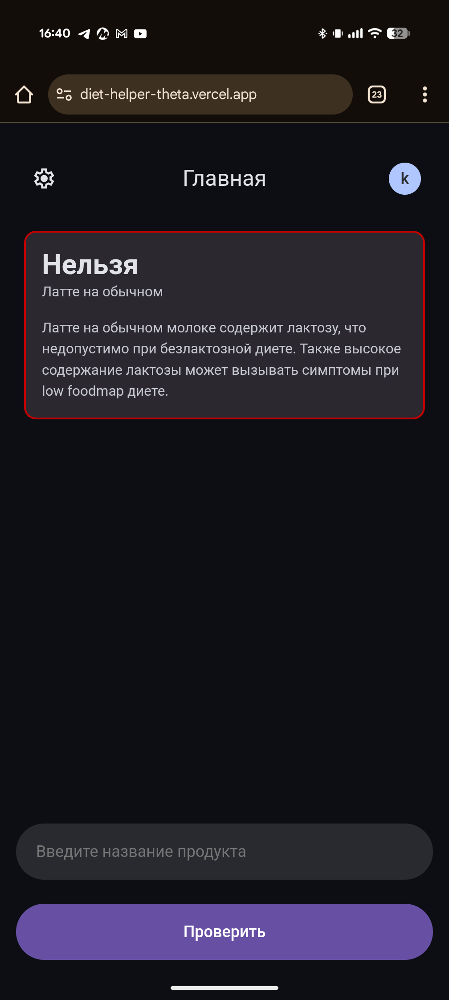
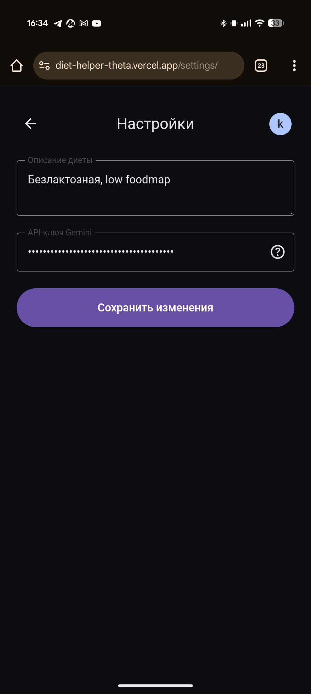

# DietHelper

Веб-приложение для проверки совместимости продуктов с вашей диетой. Использует AI-ассистента на базе Google Gemini для анализа блюд и вынесения вердикта о возможности их употребления в рамках вашего рациона.

<p align="center">
  
  
  
  
</p>

## Возможности

- **Проверка продуктов** — введите название блюда и получите мгновенный анализ совместимости с вашей диетой.
- **AI-анализ** — использует актуальную модель **Google Gemini 3.1 Flash Lite** для точной оценки продуктов.
- **Персональные настройки** — сохраняйте параметры своей диеты и ИИ-настроек в личном кабинете.
- **Безопасность данных** — персональные API-ключи пользователей шифруются на лету при сохранении в базу данных с помощью криптографического алгоритма Fernet (AES-128).
- **Система аутентификации** — безопасный вход и изоляция данных пользователей.
- **Адаптивный интерфейс** — современный дизайн в темной теме, оптимизированный под любые устройства.

## Интерфейс приложения

<p align="center">
  
  
  
  
</p>

## Технологии

**Backend:**
- **Django** — веб-фреймворк.
- **Google GenAI SDK** — интеграция с моделями Gemini.
- **Cryptography (Fernet)** — симметричное шифрование API-ключей пользователей.
- **PostgreSQL** — база данных (для продакшена).
- **WhiteNoise** — обслуживание статических файлов.

**Frontend:**
- HTML5 / CSS3 / JavaScript (ванильный стек, оптимизированный под быструю загрузку).

**Deploy:**
- **Vercel** — хостинг приложения.

## Установка и запуск

### Требования
- Python 3.11+
- Google Gemini API ключ ([получить в Google AI Studio](https://aistudio.google.com/))

### Локальная установка

1. **Клонируйте репозиторий:**
   ```bash
   git clone https://github.com/kolganovr/DietHelper.git
   cd DietHelper
   ```

2. **Создайте и активируйте виртуальное окружение:**
   ```bash
   python -m venv venv
   # Для Windows (PowerShell):
   .\venv\Scripts\Activate.ps1
   # Для Linux/macOS:
   source venv/bin/activate
   ```

3. **Установите зависимости:**
   ```bash
   pip install -r requirements.txt
   ```

4. **Настройте переменные окружения:**
   Создайте файл `.env` в корне проекта:
   ```env
   DEBUG=True
   SECRET_KEY=your-django-secret-key-here
   
   # Сгенерируйте криптографический ключ Fernet с помощью команды:
   # python -c "from cryptography.fernet import Fernet; print(Fernet.generate_key().decode())"
   FERNET_KEY=your-generated-fernet-key-here
   ```

5. **Примените миграции базы данных:**
   ```bash
   python manage.py migrate
   ```

6. **Запустите локальный сервер:**
   ```bash
   python manage.py runserver
   ```
   Приложение будет доступно по адресу: `http://127.0.0.1:8000`

## Использование

### Регистрация и вход
Создайте аккаунт в системе. Логины регистронезависимы, пароли надежно хэшируются стандартными средствами Django.

### Настройка диеты
1. Перейдите в раздел настроек (иконка шестеренки).
2. Укажите ваш Google Gemini API ключ.
3. Опишите параметры вашей диеты (например: *"Кето-диета, без сахара, без лактозы"* или *"Диета при гастрите"*).

### Проверка продуктов
1. На главной странице введите название блюда или отдельного продукта.
2. Получите вердикт: **Можно**, **Нельзя** или **С осторожностью**.
3. Ознакомьтесь с подробным медицинским и диетологическим объяснением ИИ-ассистента.

## Структура проекта

```text
DietHelper/
├── DietHelper/          # Конфигурация Django проекта
│   ├── settings.py
│   ├── urls.py
│   └── wsgi.py
├── diet/                # Основное Django-приложение
│   ├── gemini.py        # Клиент для работы с Google Gemini API
│   ├── views.py         # Логика контроллеров (Views)
│   ├── models.py        # Модели данных (в т.ч. расширенный User)
│   ├── templates/       # HTML-шаблоны страниц
│   └── static/          # Стили, изображения и скрипты
├── manage.py
├── requirements.txt     # Зависимости проекта
├── vercel.json          # Конфигурация для деплоя на Vercel
└── .graphifyignore      # Исключения для анализа структуры ИИ
```

## API Интеграция

Приложение обращается к Google Gemini API для структурированного анализа состава продуктов на соответствие диете. Запрос возвращает валидный JSON-ответ, соответствующий схеме Pydantic:

```json
{
  "verdict": "Можно" | "Нельзя" | "С осторожностью",
  "explanation": "Подробное объяснение вердикта"
}
```
Данный формат обеспечивает строгую типизацию ответов ИИ на стороне веб-приложения.
